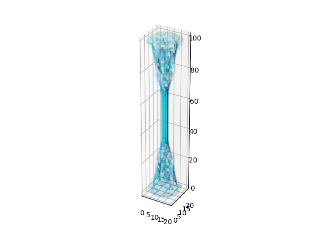

# Summary
This is an implementation of 3d Topology Optimization using cubic tessalation. 
The algorithm uses the MMA nonlinear programming optimizer to manipulate compliance, max stress, and volume as either the minimization objective or constraints.

# Example Outputs

# Motivation
The goal of the project was given by our engineering team's client, Dr. Guilleminot. 
The current process for designing bone scaffolds requires an enormous amount of time and techincal knowledge, making the process of creating custom scaffolds prohobitive.
By creating an autonomous algorithm, we can create new designs in a faster, cheaper, and stronger manner.

# Parameters
There are several key variables that you want to manipulate when designing a bone scaffold.
## Volume
In order to promote long-term growth, bone scaffolds must be ~88% porous to allow for the regrowth of bone tissue. 
This is a major challenge as determining which parts of the bone can be safely removed is a None trivial task. 
This engine supports both minimizing the total volume/density of the bone while maintaining a minimum stiffness constraint 
or maximizing stiffness while keep the volume below a certain threshold.
## Compliance
Minimizing compliance (or maximizing stiffness) is one of the most common objectives in topology optimization.
Compliance is essentially the spring force generated by deformation. By optimizing this we can create a bone that holds is shapes under heavy loads.
## Stress
Stress is the most difficult parameter to optimize. 
Since the stress is a vector calculated locally, it faces multiple problems for optimization.
First we convert stress into the von mises form to estimate a 'magnitude' of stress. 
Then we can estimate the maximum using the aggregation method (∑s^n)^(1/n) for some large n.
Keeping this max stress below the yield stress of the material is an important constraint in structure generation.

# Materials
## Solid Isotropic Material with Penalization (SIMP)
The first type of material supported in this project is variable density printing. 
This method assumes that the stiffness of the material does not depend on the direction of force and 
the youngs modulus can be approximated as density^p * max
## Gyroid
The second, and main, material supported by this engine is the gyroid. 
The gyroid is a triply periodic (repeating vert/horiz/depth) minimal surface (locally smallest area) given by the function cos(x)sin(y)+cos(y)sin(z)+cos(z)sin(x) > threshold.
It it beneficial for our project for several reasons:
- It can be parameterized for variable densities
- Strong strength/volume ratio
- Can print without support

Some beneficial characteristics of the gyroid are:
- easy to parameterize in periodic manner
- variable density
- strong strength/weight ratio
- printable without supports

# Display Options
## Matplot

## Animation

## Vedo stl

# Implementation Details
## Cached Starts
We can speed up the optimization process by starting the optimization at a better initial condition. 
This is by setting the parameter 'cache' to some .npy path. Previous results can be found in the data/struct directory
## Passive Elements & Region Constraints
Further customization of the final design can be set by forcing certain parts of the design space to stay within some constraints. 
For example, we coerce the region outside of the inscribed cylinder to be zero. This makes our design meet the envelope constraints.
## NLOPT & MMA
Due to the restrictions on our design, standard gradient descent algorithms don't work. 
Additionally, the expensive cost of each FEA analysis means that an optimization algorithm should use as few iterations as possible.
To solve this problem we use the nlopt (non-linear optimization) python libraries implementation of the Method of Moving Asymptotes.
## Iterative Solver
As previously mentioned, FEA analysis is the main bottleneck in optimization. 
Displacement is found by assembling a global stiffness matrix and solving F=KU for U. 
The analytic way to solve this would be to find K inverse, but this complexity scales at O(N^18) {^3: 3 lengths, ^2: K is nxn, ^3: complexity of inv}.
This is very prohibitive for large structures so we seek a faster way to solve these equations.
This is implements via an iterative solver that approximates U with the conjugate gradient method (See fea.py: solve_iterative).
## Load Cases
Custom loads can be supplied using the LoadCase class. Simply call .apply_force with a (fx, fy, fz) force vector and a mask of where to apply the force
To add fixed points, call .affix() with a mask of where on the structure to constrain

# Acknowledgements
- First I'd like to thank the top3d group for their helpful educational resources on how to implement simple Topology Optimization. They were a great launchpad that made getting started so much more accessible.
- Next I'd like to thank the ANSYS Additive Manufacturing Research Laboratory at the University of Pittsburg. Their paper on stress constrained topology optimization was really helpful on expanding my understanding of statics and their sensitivity derivation was something I could not have done on my own. Further they were really helpful we I reached out for further clarification on some questions.

# Requirements
- nlopt: non-linear optimization solver
- vedo: stl generation
- scipy: sparse matrices and helpful math
- numpy: arrays and math utils
- matplotlib: for optimization display

